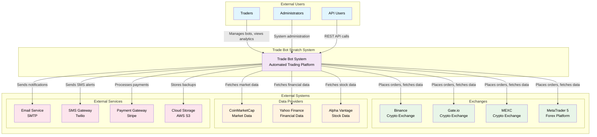
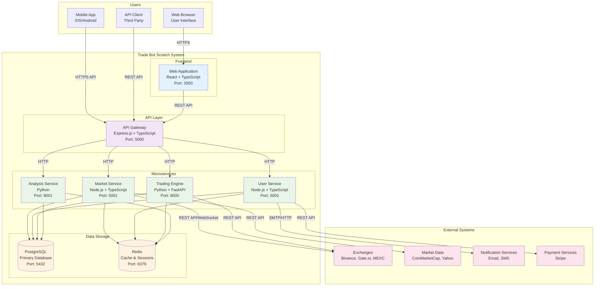
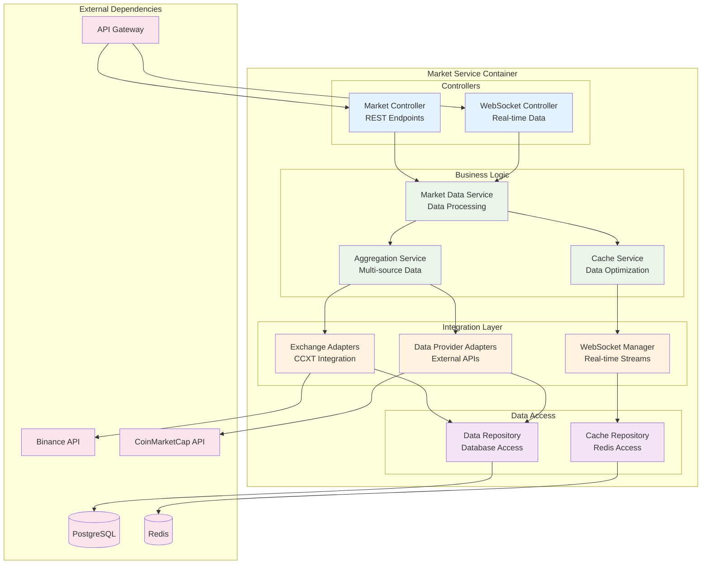
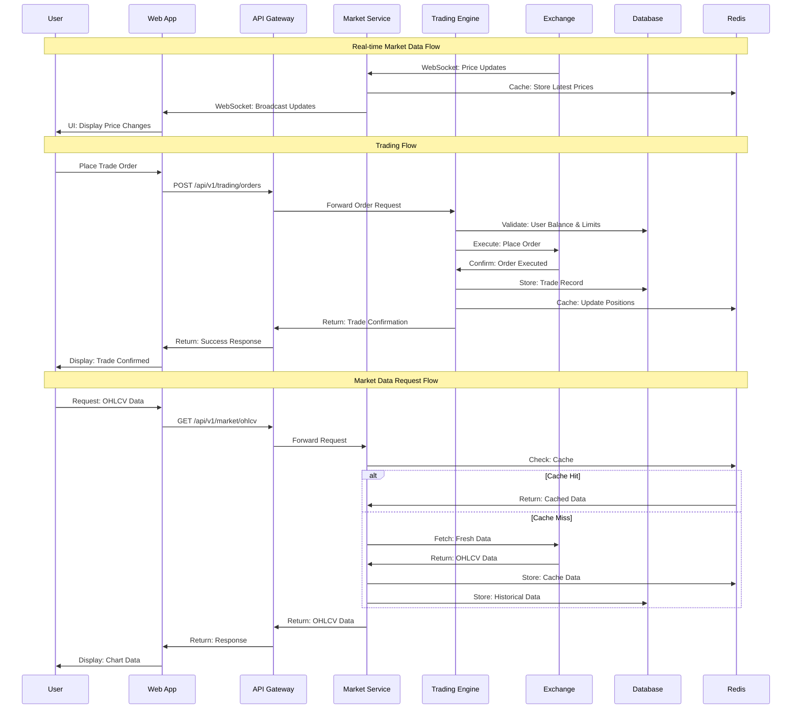
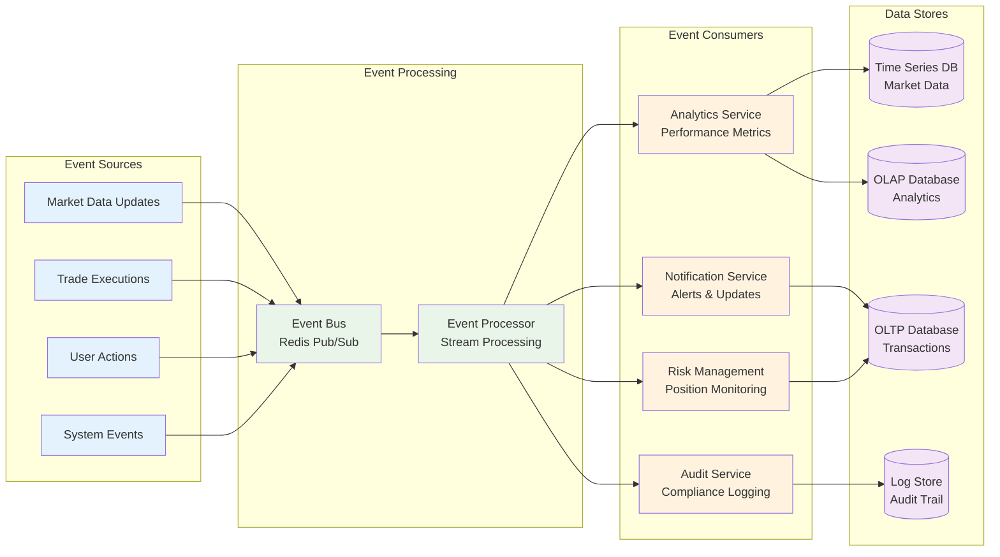
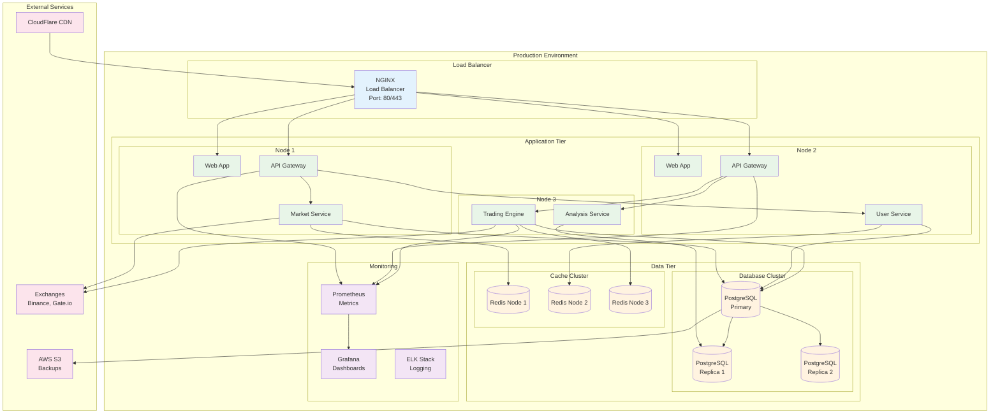
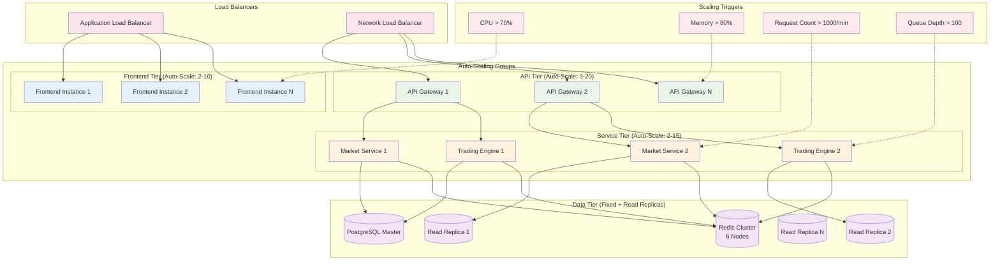

# System Context Diagrams - Trade Bot Scratch

## 🎯 Mục đích

Tài liệu này chứa các sơ đồ context tổng quan về hệ thống Trade Bot Scratch, mô tả mối quan hệ giữa hệ thống và các external entities.

## 🌐 System Context Diagram (C4 Level 1)

## 🏗️ Container Diagram (C4 Level 2)

## 🔧 Component Diagram - Market Service (C4 Level 3)

## 📊 Data Flow Diagram

## 🔄 Event Flow Diagram

## 🌍 Deployment Diagram

## 📈 Scalability Diagram

---
*Last updated: 10/08/2025*
*Version: 1.0*
